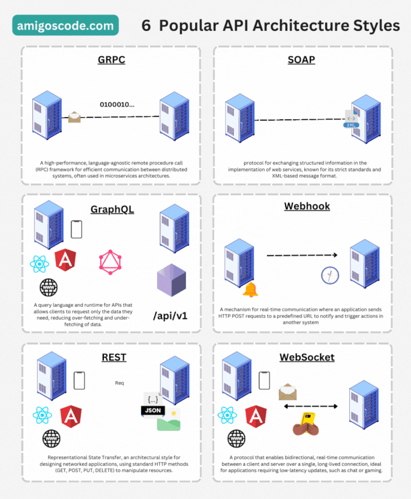

# ¿Qué es una API?
Una API (Interfaz de Programación de Aplicaciones) es un conjunto de reglas,
protocolos y herramientas que permiten a los desarrolladores interactuar con un
software, una biblioteca o un servicio externo sin necesidad de conocer cómo
están implementados internamente.

## Tipos de APIs
| Tipo         | REST               | SOAP                              | WEB SOCKET                  | GRPC                     |
|--------------|--------------------|-----------------------------------|-----------------------------|--------------------------|
| Formato      | JSON, XML          | XML                               | JSON, texto plano           | Protocol Buffers         |
| Comunicación | Sin estado         | Con estado                        | Bidireccional               | Bidireccional            |
| Usos         | Aplicaciones web, APIs públicas | Transacciones bancarias, servicios empresariales | Chat en tiempo real, juegos online | Microservicios, sistemas distribuidos |
| Características | Ligero, fácil de implementar | Estricto, seguro, confiable | Conexión persistente, baja latencia | Alto rendimiento, eficiente |

***
---
#### representacion grafica

