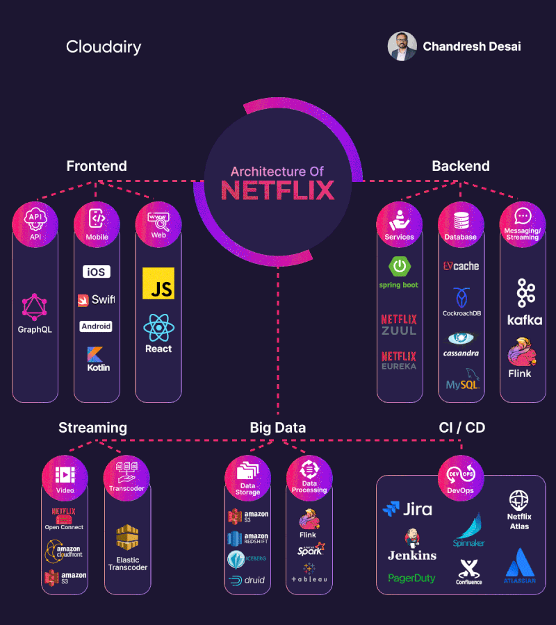
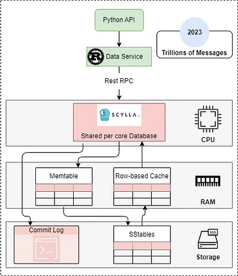

# ¿Qué es una API?
Una API (Interfaz de Programación de Aplicaciones) es un conjunto de reglas,
protocolos y herramientas que permiten a los desarrolladores interactuar con un
software, una biblioteca o un servicio externo sin necesidad de conocer cómo
están implementados internamente.

## Tipos de APIs
| Tipo         | REST               | SOAP                              | WEB SOCKET                  | GRPC                     |
|--------------|--------------------|-----------------------------------|-----------------------------|--------------------------|
| Formato      | JSON, XML          | XML                               | JSON, texto plano           | Protocol Buffers         |
| Comunicación | Sin estado         | Con estado                        | Bidireccional               | Bidireccional            |
| Usos         | Aplicaciones web, APIs públicas | Transacciones bancarias, servicios empresariales | Chat en tiempo real, juegos online | Microservicios, sistemas distribuidos |
| Características | Ligero, fácil de implementar | Estricto, seguro, confiable | Conexión persistente, baja latencia | Alto rendimiento, eficiente |

***
---
#### representacion grafica

## Ejemplo de una api rest implementada con microservicios

Esta es una grafica de como netflix gestiona sus servicios viendo que tiene muchas apis siendo la principal un aapi en java spring boot y la de video con amazon S3.

## Ejemplo de una API híbrida entre monolito y microservicios

Esta es una representación gráfica de cómo la API principal de Discord, desarrollada en Python, se comunica con un balanceador de carga escrito en Rust. Este, a su vez, interactúa con un sistema distribuido basado en ScyllaDB, la base de datos encargada de gestionar los mensajes de los usuarios.
